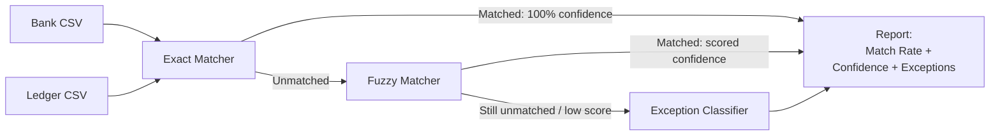

# Architecture

## Mermaid



## ASCII

```
 ┌────────────────┐     ┌──────────────────┐
 │  Bank CSV       │     │  Ledger CSV       │
 └────────┬────────┘     └────────┬──────────┘
          │                       │
          └───────────┬───────────┘
                       ▼
              ┌─────────────────┐
              │  Exact Matcher   │
              └────────┬─────────┘
                        │  (unmatched only)
                        ▼
              ┌─────────────────┐
              │  Fuzzy Matcher   │
              │ amount+date+text │
              └────────┬─────────┘
                        │  (still unmatched /
                        │   below confidence
                        │   threshold)
                        ▼
              ┌───────────────────────┐
              │ Exception Classifier   │
              └────────────┬───────────┘
                            │
                            ▼
                    ┌───────────────┐
                    │    Report      │
                    │ - Match Rate   │
                    │ - Confidence   │
                    │ - Exceptions   │
                    └───────────────┘
```
